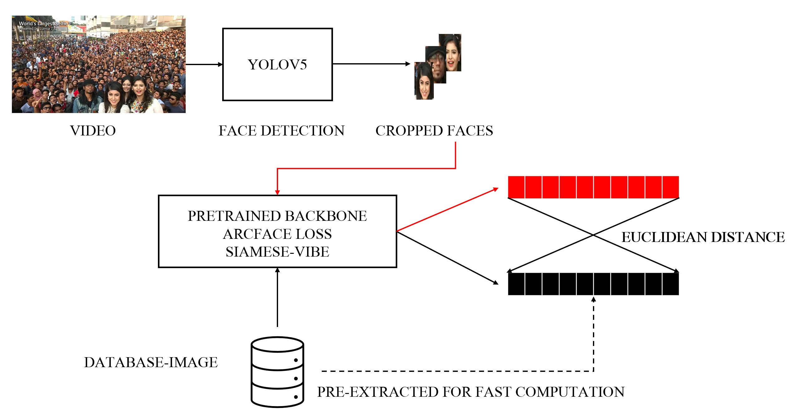

# FaceID--YOLOV5.ArcFace
ONNX implementation of YOLOv5 and Siamese Network (ResNet100) with ArcFace loss for Face Detection and Recognition

<p>
  
</p>

# Environment Setup
```python 
conda install faceid torchvision torchaudio pytorch-cuda=11.7 -c pytorch -c nvidia
conda activate faceid
pip install opencv-python
pip install onnxruntime==1.14.0
pip install onnxruntime-gpu==1.14.0
git clone https://github.com/PhucNDA/FaceID--YOLOV5.ArcFace
cd FaceID--YOLOV5.ArcFace
```
Ensuring the right data tree format

    FaceID--YOLOV5.ArcFace
    ├── database_image
    │   ├── profile1.png
    |   ├── profile2.png
    |   ├── profile3.png
    |   ├── ...
    ├── database_tensor
    │   ├── profile1.npy
    |   ├── profile2.npy
    |   ├── profile3.npy
    |   ├── ...

**database_image**: containing image for each profile

**database_tensor**: containing vector feature extracted by pretrained backbone for each profile

# Face Detection
Making a few key modifications to the YOLOv5 and optimize it for face detection. These modifications include adding a five-point landmark regression head, using a stem block at the input of the backbone, using smaller-size kernels in the SPP, and adding a P6 output in the PAN block. YOLOv5 is pretrained on WIDERFace datasets and we already converted it to the ONNX gpu runtime:
 ```python
 yolov5m-face.onnx
 ```
 # New Face
