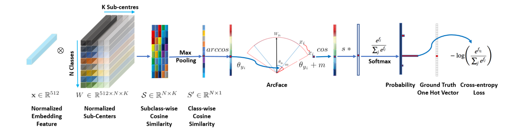

# FaceID--YOLOV5.ArcFace
ONNX implementation of YOLOv5 and Siamese Network (ResNet100) with ArcFace loss for Face Detection and Recognition

<p>
  
</p>

<p>
    <video src=https://user-images.githubusercontent.com/108280892/219567517-6b2bb3c2-9e6f-4d91-bb0b-bc9b66d29f13.mp4>
</p>


# Environment Setup
```python 
conda install faceid torchvision torchaudio pytorch-cuda=11.7 -c pytorch -c nvidia
conda activate faceid
pip install opencv-python
pip install onnxruntime==1.14.0
pip install onnxruntime-gpu==1.14.0
git clone https://github.com/PhucNDA/FaceID--YOLOV5.ArcFace
cd FaceID--YOLOV5.ArcFace
```
Ensuring the right data tree format

    FaceID--YOLOV5.ArcFace
    ├── database_image
    │   ├── profile1.png
    |   ├── profile2.png
    |   ├── profile3.png
    |   ├── ...
    ├── database_tensor
    │   ├── profile1.npy
    |   ├── profile2.npy
    |   ├── profile3.npy
    |   ├── ...

**database_image**: containing image for each profile

**database_tensor**: containing vector feature extracted by pretrained backbone for each profile

# Face Detection
Making a few key modifications to the YOLOv5 and optimize it for face detection. These modifications include adding a five-point landmark regression head, using a stem block at the input of the backbone, using smaller-size kernels in the SPP, and adding a P6 output in the PAN block. YOLOv5 is pretrained on WIDERFace datasets and we already converted it to the ONNX gpu runtime:
 ```python
 yolov5m-face.onnx
 ```
 # Adding New Face
Pre-trained backbone ResNet100 weights on Glint360K which contains 17091657 images of 360232 individuals is available at : [weights](https://drive.google.com/drive/folders/1-DNgNFw-gQII1w0XK9hDBWaZsi4EEs-b?usp=share_link)

Manually add new face images to folder:
```python
database_image
```
For fast precomputation, pre-extract database images to .npy tensor:
```python
python feature_extraction.py --weight 'weights/backbone.pth' --path_database database_image
```
```python
database_tensor
```
Convert backbone weight to ONNX implementation:
```python
python converttoonnx.py
```
# Face Recognition
  It is implemented on ResNet100 backbone and SOTA ArcFace loss: [paper](https://arxiv.org/pdf/1801.07698.pdf)
  
  Following is the pipeline of ArcFace loss:
<p>
  
</p>

  Transfer-learning by training new faces on custom datasets is not neccessary in face recognition algorithm. Using a pre-trained weight on large-scale dataset is enough for feature extraction backbone. Using asia-oriented dataset might lead to bias toward inference phase. 
# Webcam Real-time GPU inference
```python 
python detection_gpu.py
```
This version is good enough for face recognition system. Adding threshold for Unknown classification depends on user-experience. The model performs well on tilted face and obscured face (facemask). More improvements will be carried out in the future.
  
<p>
    <video src=https://user-images.githubusercontent.com/108280892/219566480-afac4b2a-042d-44b1-8837-06d894567d18.mp4>
</p>
  
 # Contribution
  I want to express sincere thanks to my colleagues at University of Information Technology - UIT for their contribution to this project.
| Serial | Full name              | Github                                               | Email                   |
| ------ | ----------------------:|-----------------------------------------------------:|-------------------------:
| 1      | Nguyễn Đức Anh Phúc |[PhucNDA](https://github.com/PhucNDA)          |phucnda@gmail.com   |
| 2      | Huỳnh Viết Tuấn Kiệt |[hiimking1509](https://github.com/HiImKing1509)          |20521494@gm.uit.edu.vn   |
| 3      | Nguyễn Nhật Trường |[truongnn](https://github.com/truong11062002)          | 20522087@gm.uit.edu.vn   |
| 4      | Lại Chí Thiện |[hiimking1509](https://github.com/laichithien)          | 20520309@gm.uit.edu.vn   |
| 5      | Lê Việt Thịnh |[levietthinh](https://github.com/levietthinh)          |vietthinh101@gmail.com   |
| 5      | Trương Thành Thắng |[erwin24092002](https://github.com/erwin24092002)          |20521907@gm.uit.edu.vn   |
  
  # Acknowledgement 
  This project is carried out in order to build and embedded system for door unlocking 10E8 at University of Information Technology - UIT. Further implementation on Raspberry pi 4 will not be updated for privacy concerns. The ONNX model can be used for academic and reproduction purposes only, but any commercial use is prohibited.
